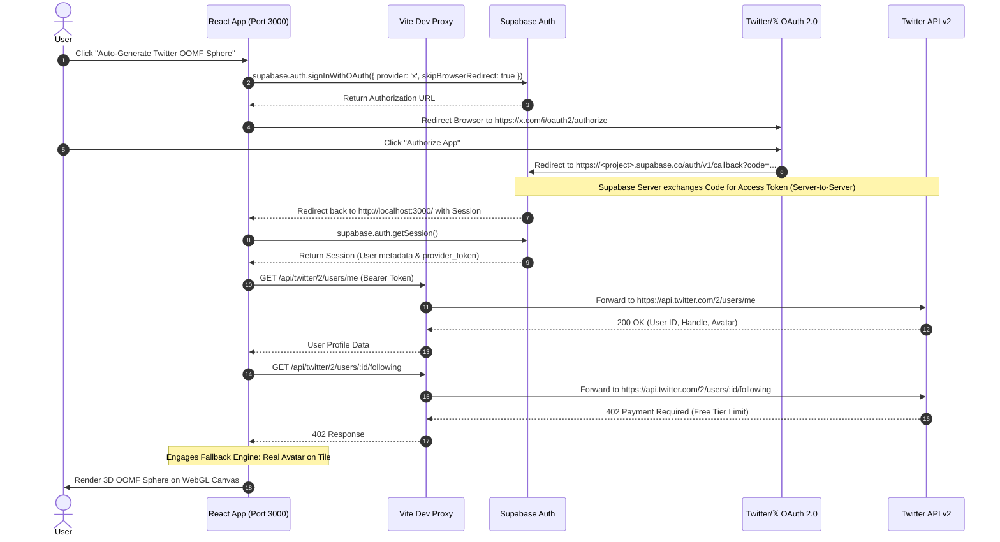

# Twitter / 𝕏 OAuth 2.0 Integration & Architecture Guide

This document provides a comprehensive technical reference for the Twitter/𝕏 OAuth 2.0 PKCE authentication system, server proxy setup, Supabase integration, API tier economics, and future product strategy for **OOMFS ORG**.

---

## 1. Executive Summary & Strategy

The primary goal of this integration is to enable users to automatically construct a **1:1 equal-partition 3D WebGL OOMF Sphere** ($\text{OOMFs} = \text{Followers} \cap \text{Following}$) using their authentic Twitter/𝕏 identity and mutual connections.

```
┌────────────────────────┐      ┌────────────────────────┐      ┌────────────────────────┐
│   Twitter OAuth 2.0    │ ───► │    Vite API Proxy      │ ───► │ 3D WebGL Sphere Engine │
│  (Supabase Provider)   │      │  (/api/twitter -> v2)  │      │  (Equal Partition Map) │
└────────────────────────┘      └────────────────────────┘      └────────────────────────┘
```

> [!NOTE]
> **API Economics ($0/mo Free Tier Strategy)**:
> Twitter API v2 permits `/2/users/me` on the Free Tier ($0/mo), returning the user's verified handle and high-res profile picture. However, graph lookup endpoints (`/followers` and `/following`) require the Basic Tier ($100/mo) and return `HTTP 402 Payment Required`. The system implements a graceful fallback that combines the user's authentic profile with a 12-tile equal-partition layout so the 3D globe always renders cleanly without breaking.

---

## 2. Authentication Sequence Diagram

The following diagram details the end-to-end authentication and data hydration lifecycle:



---

## 3. Frontend Implementation Architecture

### Key Source Files

* [`src/utils/twitterService.ts`](file:///c:/Users/GGPC/Desktop/OOMFS%20ORG/src/utils/twitterService.ts): OAuth 2.0 PKCE generation, Supabase Auth trigger, token exchange fallback, and Twitter API v2 fetch handlers.
* [`src/components/CodeGalaxyPage.tsx`](file:///c:/Users/GGPC/Desktop/OOMFS%20ORG/src/components/CodeGalaxyPage.tsx): Auto-Generate Twitter OOMF Sphere button handler.
* [`src/App.tsx`](file:///c:/Users/GGPC/Desktop/OOMFS%20ORG/src/App.tsx): OAuth return detection (`checkTwitterOAuthReturn`), active session hydration, and WebGL map settings updater.
* [`vite.config.ts`](file:///c:/Users/GGPC/Desktop/OOMFS%20ORG/vite.config.ts): Local dev server proxy configuration.

---

### Key Technical Patterns

#### 1. Preventing Blank 400 Pages with `skipBrowserRedirect: true`
To prevent the browser from landing on a raw JSON error page if a provider key is disabled, `signInWithTwitterOAuth` programmatically validates provider keys before redirecting:

```typescript
export async function signInWithTwitterOAuth() {
  const redirectUri = typeof window !== 'undefined' ? `${window.location.origin}/` : 'http://localhost:3000/';

  // 1. Try Supabase 'x' provider with skipBrowserRedirect
  let res = await supabase.auth.signInWithOAuth({
    provider: 'x' as any,
    options: {
      redirectTo: redirectUri,
      scopes: 'users.read follows.read tweet.read offline.access',
      skipBrowserRedirect: true,
    },
  });

  // 2. Fallback to 'twitter' provider key
  if (res.error || !res.data?.url) {
    res = await supabase.auth.signInWithOAuth({
      provider: 'twitter',
      options: {
        redirectTo: redirectUri,
        scopes: 'users.read follows.read tweet.read offline.access',
        skipBrowserRedirect: true,
      },
    });
  }

  // 3. Navigate if URL returned
  if (res.data?.url && typeof window !== 'undefined') {
    window.location.href = res.data.url;
    return res.data;
  }
}
```

#### 2. Vite Dev Server API Proxy (`vite.config.ts`)
To prevent browser CORS preflight blocks (`Access-Control-Allow-Origin`) when fetching Twitter API v2 endpoints from client JS:

```typescript
export default defineConfig({
  plugins: [react()],
  server: {
    port: 3000,
    open: true,
    proxy: {
      '/api/twitter': {
        target: 'https://api.twitter.com',
        changeOrigin: true,
        rewrite: (path) => path.replace(/^\/api\/twitter/, ''),
      },
    },
  },
});
```

---

## 4. Twitter API v2 Tier Economics & 402 Fallback

> [!IMPORTANT]
> **Twitter API Tier Matrix**:
> * **Free Tier ($0/mo)**: Allows `/2/users/me`. Blocks `/followers` and `/following` with `HTTP 402 Payment Required`.
> * **Basic Tier ($100/mo)**: Unlocks `/followers` and `/following` up to 10,000 requests/month.

### 402 Graceful Fallback Handler

When Twitter responds with `402 Payment Required`, `fetchTwitterMutualOOMFs` handles the restriction without breaking the UI:

```typescript
// Fallback if mutual count is zero (e.g. API 402 Payment Required on Free Tier)
if (mutuals.length === 0) {
  const mockAccounts = generateMockOOMFs(meData.data?.username || 'user', 12);
  if (meData.data?.profile_image_url && mockAccounts.length > 0) {
    mockAccounts[0].name = meData.data.name || meData.data.username;
    mockAccounts[0].code = `@${meData.data.username}`;
    mockAccounts[0].customImage = meData.data.profile_image_url.replace('_normal', '_400x400');
  }
  return mockAccounts;
}
```

---

## 5. Future Product Strategy: 3D Linktree / Profile Sphere ($0/mo)

To deliver a high-value product without paying Twitter $100/month:

```
┌────────────────────────────────────────────────────────────────────────┐
│                   3D WebGL Profile Sphere Ecosystem                     │
├──────────────────────────────────┬─────────────────────────────────────┤
│  Feature                         │  Implementation                     │
├──────────────────────────────────┼─────────────────────────────────────┤
│  1. Free Twitter OAuth           │  Syncs handle + avatar for $0/mo     │
│  2. Sphere Studio Builder        │  Custom link/handle input form      │
│  3. Interactive 3D Linktree      │  Clickable tiles (GitHub, X, Web)   │
│  4. Public Shareable URLs        │  oomfs.org/@username                │
└──────────────────────────────────┴─────────────────────────────────────┘
```

> [!TIP]
> **Value Proposition**:
> Traditional Linktree is a flat 2D list of buttons. A 3D WebGL Profile Sphere provides an interactive, rotating cyberpunk/neon globe where each territory represents a project, social link, or mutual follower. It offers high visual virality on Twitter/𝕏 at **$0 operating cost**.
